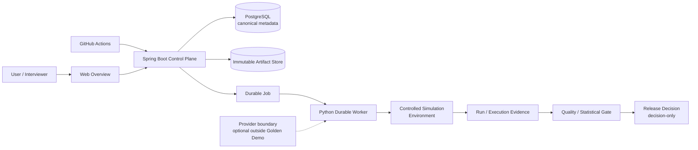
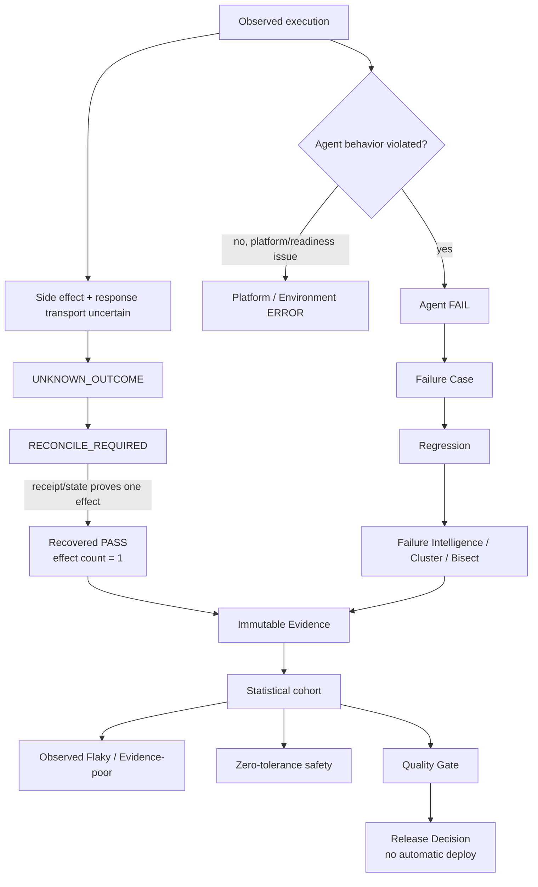

# RunProof Golden Demo

RPF-19 将 RunProof 收敛为一条可离线复现的 5～10 分钟调查路径。它使用正式 Control Plane/API 和 immutable reviewed corpus，不执行 DeepSeek 调用，不需要云账号，也不把 `ELIGIBLE` 解释为 release/deploy 授权。

## 1. 启动

前置条件：Windows、Docker Desktop（本地已有 `postgres:16-alpine`）、Java 17+、Python 3.11+、Node.js/npm、Maven。首次运行若正式 Control Plane JAR 不存在，入口脚本会执行一次 Maven package。

```powershell
powershell -ExecutionPolicy Bypass -File demo/start-demo.ps1
```

启动脚本会按固定边界完成：

1. 启动或恢复本地 named PostgreSQL container/volume；
2. 启动正式 `control-plane/`；
3. 通过 `runtime.runproof_runtime.control_plane_client` 注册全部 reviewed corpus；
4. 对 Golden Demo refs 做 canonical metadata + verified artifact read-back；
5. 以 API-backed mode 启动 Vite Web。

入口不会读取 `DEEPSEEK_API_KEY`，不会创建云资源，不会重新执行 20-trial 或 fault corpus。首次准备后的入口通常只需等待 PostgreSQL、Java readiness 和 Web ready；具体本机时长以当前运行实测为准。

浏览器打开：<http://127.0.0.1:4173/overview>

直接验证 profile 和 seed 幂等性：

```powershell
python demo/verify-golden-demo.py --root . --json
python demo/seed_demo.py --root . --repeat 2 --json
```

停止并保留数据以便重启：

```powershell
powershell -ExecutionPolicy Bypass -File demo/stop-demo.ps1
```

停止并删除本 Demo 自己创建的 exact container、volume、artifact copy 和本地 credential：

```powershell
powershell -ExecutionPolicy Bypass -File demo/stop-demo.ps1 -RemoveData
```

`.local/rpf-19/demo/` 被 Git 忽略；其中的 credential 只用于本机 Control Plane service boundary，不进入 manifest、artifact、前端 bundle 或 Git。

## 2. Versioned Golden Demo contract

唯一 profile 是 [`demo/rpf-19-golden-demo-v1.json`](../demo/rpf-19-golden-demo-v1.json)。它冻结：

- demo identity/version、reviewed corpus source commit 和 runtime source hash；
- Production Change Agent 与 Incident Remediation Agent 两个 identity；
- Baseline/Candidate deterministic Evaluation；
- Stable / Flaky / Safety / Evidence-poor Statistical Evaluation；
- Wilson interval comparison、Incident Failure Case/Cluster、cross-Agent structural Cluster；
- Version Bisect、Release Decision、response-lost Run；
- 每个 reviewed artifact 的 schema、entity identity、content hash、source hash；
- Overview 期望断言、seed/start method 与 no-provider/no-cloud/no-release 边界。

`demo/verify-golden-demo.py` 在 seed 前检查 refs、schema、identity、bytes、source hash、commit 存在性和禁止的 secret/mock/production claim。它不生成数据，也不改写历史 reviewed bytes。

## 3. 5～10 分钟主路径

1. **Overview**：从 Candidate → Evidence → Failure → Regression → Gate 看到项目闭环，确认两个 Agent、四种 Statistical outcome、Failure Family、Bisect、Decision 和 durable evidence boundary。
2. **Statistical**：打开 Stable、Flaky、Safety、Evidence-poor，展开 trial matrix；解释 Agent denominator 与 attempted/evidence denominator 的区别、Wilson interval、`OBSERVED_FLAKY` 和 zero-tolerance safety。
3. **Failure**：进入 Incident domain Failure Cluster，说明 structural family 与 exact Failure Case identity 分开；继续进入 Failure Case、source/reproduction Run 和 first divergence。
4. **Version**：进入 Version Bisect，确认相同 Regression oracle 下 `PASS → FAIL` boundary 与 first bad candidate，并说明非单调/不兼容时 fail closed。
5. **Durable**：打开 response-lost Run；说明 `side effect succeeded → response lost → UNKNOWN_OUTCOME → reconcile → effect count = 1`。RPF-14/RPF-18 的 PostgreSQL durable worker probe 作为正式执行证据，页面只读。
6. **Release**：打开 Incident Candidate Release Decision，说明 `ELIGIBLE` 仅是 decision-only evidence outcome，不是生产发布动作。

稳定 deep links：

| Story | Route |
|---|---|
| Overview | `/overview` |
| Statistical cohort index | `/statistical-evaluations` |
| Statistical detail | `/statistical-evaluations/statistical-evaluation-rpf18-flaky` |
| Statistical comparison | `/statistical-comparisons/statistical-comparison-rpf18-baseline-vs-stable` |
| Failure Intelligence | `/failure-intelligence` |
| Flagship cluster | `/failure-intelligence/clusters/failure-cluster-domain-family-e4e932d9cc3b53e0` |
| Version Bisect | `/version-bisects/version-bisect-8ad1ee6051c564080255` |
| Release Decision | `/release-decisions/release-decision-rpf16-reviewed-candidate` |
| Response-lost Run | `/runs/run-incident-b00813da-8cae-4b80-84c4-98303ac85804` |

## 4. Architecture overview



The primary path is HTTP/JSON through the formal Control Plane. The browser never connects to PostgreSQL, never holds worker/decision credentials, and never falls back silently to fixture data when API mode is unavailable.

## 5. Reliability semantics



These states are intentionally not interchangeable: Platform ERROR is excluded from the Agent quality denominator; `UNKNOWN_OUTCOME` blocks blind retry until reconciliation; Regression is additive historical evidence; `OBSERVED_FLAKY` is not a live probability; safety events remain hard blockers.

## 6. Claim → Evidence

| Claim | Repository evidence | Verification |
|---|---|---|
| Crash-safe durable execution | `control-plane/`, RPF-14 execution/reconcile evidence, response-lost reviewed Run | `python control-plane/probe.py`; RPF-14 verifier |
| Two explicit Agent contracts | `runtime/reviewed-rpf16-incident-*`, Production Change reviewed Run | `python spikes/rpf-16/probe.py --verify` |
| Failure Intelligence and structural identity | `runtime/reviewed-rpf17-*.json` | `python spikes/rpf-17/probe.py --verify` |
| Statistical Reliability boundary | `runtime/reviewed-rpf18-statistical-*.json` | `python spikes/rpf-18/verify-evidence.py` |
| Wilson interval comparison | `runtime/runproof_runtime/statistical.py` and RPF-18 comparison | runtime statistical tests |
| Formal API-backed Web | `web/src/data/controlPlaneApi.ts`, `control-plane/` | Web tests/typecheck/build; API-unavailable fail-closed smoke |
| Hosted CI gate | `.github/workflows/release-gate.yml` | GitHub Actions hosted run |
| Golden Demo integrity | `demo/rpf-19-golden-demo-v1.json` and `demo/verify-golden-demo.py` | profile verifier + seed read-back |

The project remains `Stabilization`. Local production-like infrastructure, deterministic controlled simulation and reviewed evidence are not claims of managed PostgreSQL HA, Production deploy readiness, OAuth/RBAC/Approval, broker/scheduler, or real Production remediation.

## 7. Local acceptance measurements

在 2026-09-15 的本机验证中，`demo/start-demo.ps1` 首次从现有 `postgres:16-alpine` image 启动 PostgreSQL、正式 Control Plane、seed 和 Web 到 ready 共约 21.56 秒；停止 Control Plane 后再次执行入口脚本，PostgreSQL named volume 保持不变、86 个 artifact registration 均为 `IDEMPOTENT_REPLAY`，恢复共约 13.93 秒。`demo/seed_demo.py --repeat 2` 的两轮 86-artifact registration 与 15 个 profile ref read-back 通过，耗时约 6.15 秒，未调用 Provider。

API-backed Overview、8 个关键 deep-link 页面（Agent、Statistical、Failure Cluster、Failure Case、Version Bisect、Release Decision、response-lost Run、Executions）均完成可访问性/overflow smoke；1440 与 1280 桌面 viewport 的 `scrollWidth` 未超过可视宽度。Control Plane 被停止时，Overview 显示 `Canonical data is unavailable.`，没有静默回退到 fixture；恢复后 API-backed Overview 再次加载。

`npm run build` 当前仍报告单入口 chunk 约 `1,338.82 kB`（gzip 约 `192.26 kB`）的 Vite warning。原因是现有 reviewed corpus 为 API activation 与显式 fixture/test 共用的静态、可审查输入，当前仍集中在既有 read-model bundle；本 Plan 未做高风险全量 route-level lazy refactor。它不阻塞本地 Golden Demo 或 API contract，后续若进入产品规模化可单独以 bundle budget Plan 处理。
